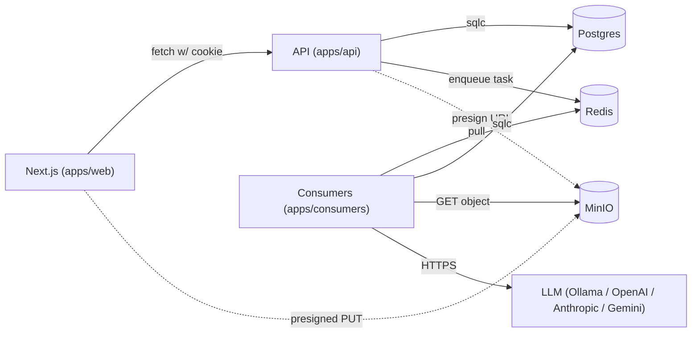
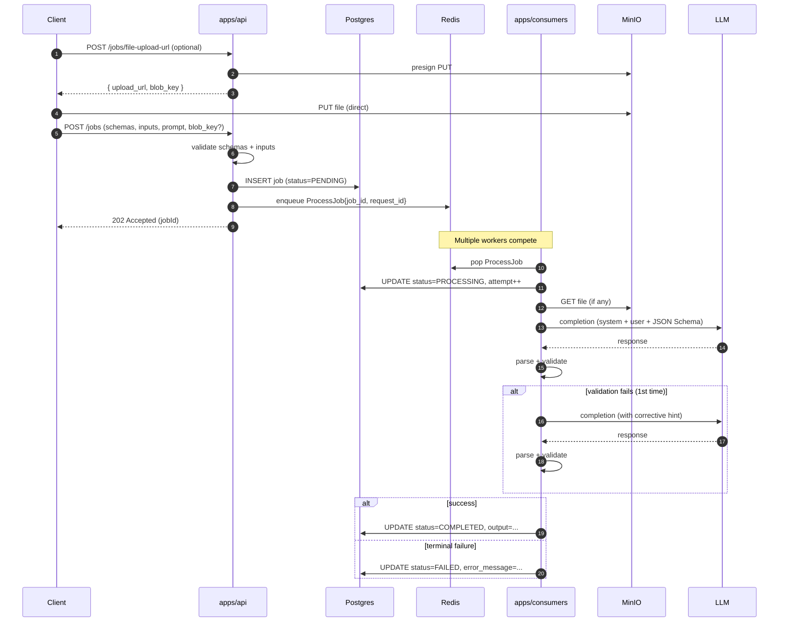

# Architecture

## Overview

Tempest-AI is split into three runtime processes:

- **`apps/api`** - the HTTP edge. Stateless. Only validates,
  persists metadata, mints presigned blob URLs, and enqueues.
- **`apps/consumers`** - the workhorse. Stateless. Pulls work off Redis,
  runs the LLM, validates the response, writes results back.
- **`apps/web`** - thin Next.js client.

Backing services: Postgres (system of record), Redis (Asynq broker),
MinIO (S3-compatible blob store).



## Why this shape

- **Async by default.** The API never blocks on an LLM call. Submitting
  a job is a metadata write + a tiny enqueue. Latency stays predictable
  even when the LLM is slow or down.
- **Competing consumers.** Asynq is just a Redis client - run more
  consumer pods, they share the work without coordination. `make
  scale-consumers N=4` demonstrates this in one command.
- **Postgres is the source of truth.** Tasks carry only the `job_id`.
  This keeps Redis memory tiny and avoids drift if a job is re-tried
  after a write that updated DB state.
- **Files don't go through the API.** The API mints a presigned PUT
  URL; the browser uploads straight to MinIO. The 5GB limit is
  enforced via `MAX_FILE_SIZE_BYTES` and a stat-after-upload check
  before the job is created.
- **Validation everywhere.** The schema DSL is validated structurally
  on POST, the user-supplied inputs are validated against the input
  schema, the LLM's response is validated against the output schema
  (with one retry on failure).

## Job lifecycle



## Auth

Server-side sessions, no JWTs. Flow:

1. `POST /auth/signup` or `/login` -> bcrypt verify -> insert a row in
   `sessions` with the **sha256** of a 256-bit random opaque token, set
   `expires_at`.
2. The **raw** token is returned only in the `Set-Cookie` header
   (`HttpOnly`, `SameSite=Lax`, `Secure` in prod).
3. Subsequent requests run through `middleware.RequireAuth`, which
   sha256s the cookie and looks up the row. The middleware joins on
   `users` so every authenticated handler gets the user without a
   second query.
4. `POST /auth/logout` deletes the row by `token_hash`.

Login intentionally returns the same generic 401 with comparable
timing whether the email is unknown or the password is wrong, so the
API is not a user-enumeration oracle.

## Structured logging - follow the flow

The whole point of `request_id` propagation is that you can take a
single id from a curl response header (`X-Request-ID`) and grep across
both processes' logs to see exactly what happened.

What ships with every record:

| Field        | Source                                                 |
|--------------|--------------------------------------------------------|
| `service`    | `api` or `consumers`, set on the root logger           |
| `request_id` | generated by `middleware.RequestID`; carried into Asynq |
| `user_id`    | set by `middleware.RequireAuth`                        |
| `job_id`     | set after the job row is created                       |
| `task_id`    | Asynq's own task identifier                            |

Concrete events you'll see for a single happy-path job:

```
service=api  http.request method=POST path=/jobs status=202
service=api  job.created job_id=... task_id=... provider=ollama:llama3:8b
service=consumers task.received task_type=job:process retry=0
service=consumers job.processing
service=consumers job.provider_selected provider=ollama:llama3:8b
service=consumers llm.request.sent
service=consumers llm.response.received
service=consumers job.completed output_bytes=...
service=consumers task.completed latency=...
```

The `pgx` query tracer logs every DB query at `DEBUG`, escalating to
`WARN` for queries over 50ms.

## Failure modes & retries

- **LLM call errors** (network, rate limit, etc.) bubble up to Asynq,
  which retries with exponential backoff (`30s -> 60s -> 2m -> 4m ...`,
  capped at 1h, max 5 retries).
- **Schema validation errors** on the LLM's output trigger one
  in-process retry with a corrective hint appended to the prompt.
  After that, the job is marked `FAILED` and Asynq does **not** retry.
- **Bad user data** (malformed schema, mismatched inputs) marks the
  job `FAILED` immediately - retrying won't help.
- **DB transient errors** during state transitions return errors from
  the handler, which Asynq treats as retryable.
